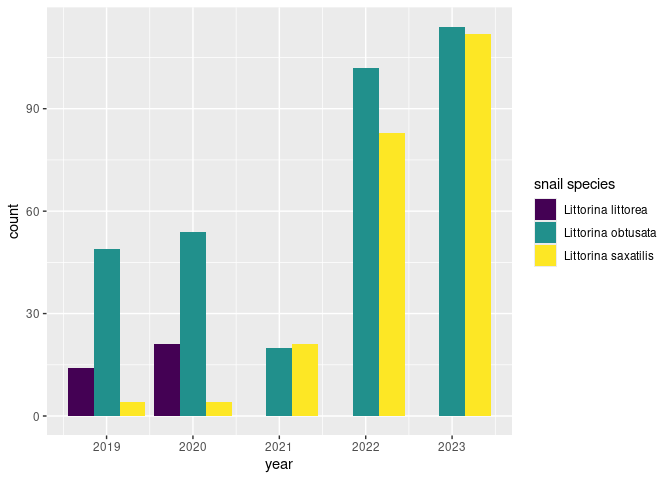
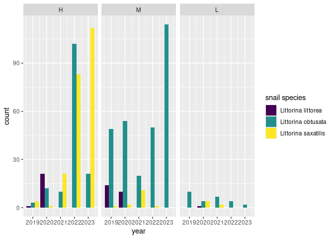
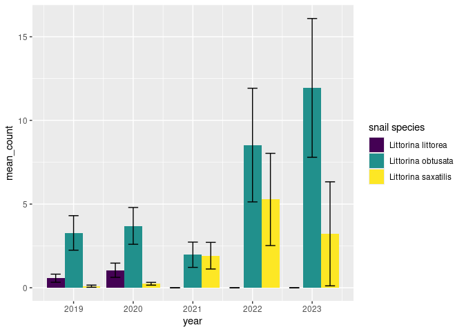
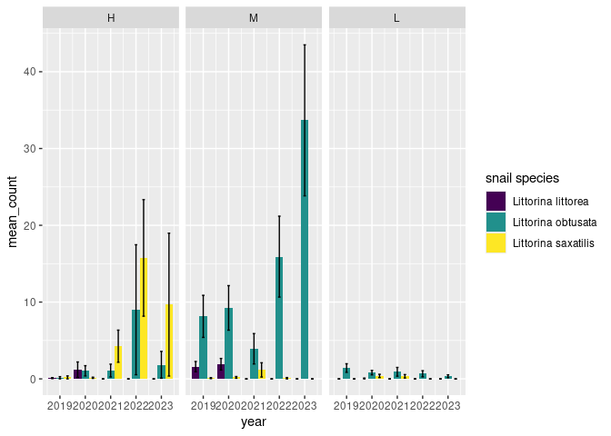
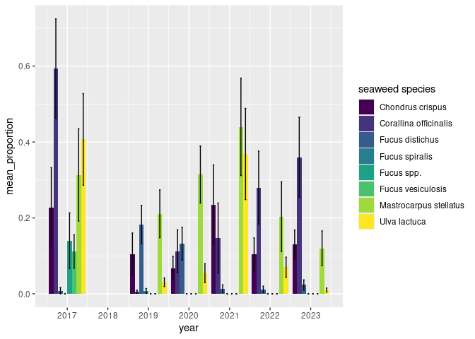
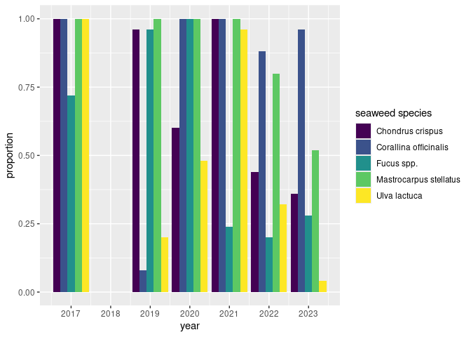
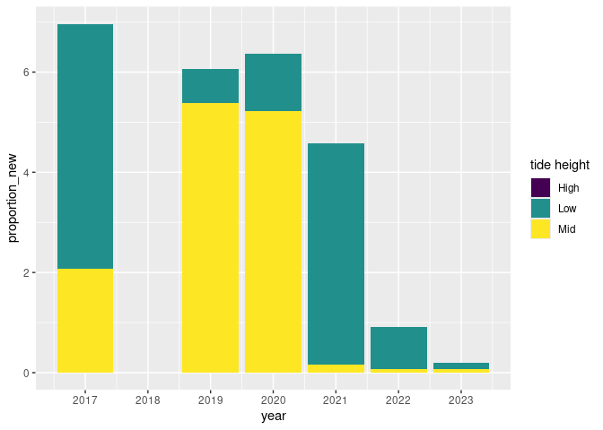

MDR graphs
================
Kalimari

``` r
library(tidyverse)
library(broom)
library(readxl)
library(scales)
library(lubridate)
library(ggplot2)
library(waffle)
library(dplyr)
library(ggtext)

se <- function(x) sd(x)/sqrt(length(x))
```

``` r
expanded_inverts_mdr <- read_csv("/cloud/project/analysis/expanded_inverts_mdr.csv")
```

    ## Rows: 9652 Columns: 7
    ## ── Column specification ────────────────────────────────────────────────────────
    ## Delimiter: ","
    ## chr  (2): tide_ht, invert_species
    ## dbl  (4): year, quadrat_m, count, quadrat_number
    ## dttm (1): date
    ## 
    ## ℹ Use `spec()` to retrieve the full column specification for this data.
    ## ℹ Specify the column types or set `show_col_types = FALSE` to quiet this message.

``` r
expanded_seaweeds_mdr <- read_csv("/cloud/project/analysis/expanded_seaweeds_mdr.csv")
```

    ## Rows: 5968 Columns: 12
    ## ── Column specification ────────────────────────────────────────────────────────
    ## Delimiter: ","
    ## chr  (2): tide_ht, seaweed_species
    ## dbl  (9): year, quadrat_m, Asco_n_ht, Asco_n_bladders, squares_out_of_25, pr...
    ## dttm (1): date
    ## 
    ## ℹ Use `spec()` to retrieve the full column specification for this data.
    ## ℹ Specify the column types or set `show_col_types = FALSE` to quiet this message.

``` r
mdr_temp_allyears <- read_csv("/cloud/project/analysis/mdr_temp_allyears.csv")
```

    ## Rows: 38566 Columns: 7
    ## ── Column specification ────────────────────────────────────────────────────────
    ## Delimiter: ","
    ## chr  (1): tz
    ## dbl  (3): year, temp, temp_C
    ## dttm (1): date_time
    ## date (1): date
    ## time (1): time
    ## 
    ## ℹ Use `spec()` to retrieve the full column specification for this data.
    ## ℹ Specify the column types or set `show_col_types = FALSE` to quiet this message.

``` r
all_tide_time <- read_csv("/cloud/project/analysis/all_tide_time.csv")
```

    ## Rows: 9491 Columns: 5
    ## ── Column specification ────────────────────────────────────────────────────────
    ## Delimiter: ","
    ## chr  (1): tide_ht
    ## dbl  (1): tide_height
    ## dttm (1): date_time
    ## date (1): date
    ## time (1): time
    ## 
    ## ℹ Use `spec()` to retrieve the full column specification for this data.
    ## ℹ Specify the column types or set `show_col_types = FALSE` to quiet this message.

``` r
expanded_inverts_mdr %>%
  filter(invert_species %in% c("Litt_l",
                               "Litt_o",
                               "Litt_s"),
         !(year == 2017)) %>%
  ggplot(mapping = aes(year, count, fill = invert_species)) +
    geom_col(position = "dodge") +
  labs(fill = "snail species") +
  scale_fill_viridis_d(
    labels = c("Litt_l" = "Littorina littorea",
               "Litt_o" = "Littorina obtusata",
               "Litt_s" = "Littorina saxatilis")
  )
```

<!-- -->

``` r
expanded_inverts_mdr %>%
  filter(invert_species %in% c("Litt_l",
                               "Litt_o",
                               "Litt_s"),
         !(year == 2017),
         !is.na(tide_ht)) %>%
  mutate(tide_ht = fct_relevel(tide_ht, c("H", "M", "L"))) %>%
  ggplot(mapping = aes(year, count, fill = invert_species)) +
    geom_col(position = "dodge") +
  labs(fill = "snail species") +
  scale_fill_viridis_d(
    labels = c("Litt_l" = "Littorina littorea",
               "Litt_o" = "Littorina obtusata",
               "Litt_s" = "Littorina saxatilis")
  ) +
  facet_wrap("tide_ht", nrow = 1)
```

<!-- -->

``` r
# omitted 2017 and 2018 for all snail graphs (2017 includes L_spp, so not useful for these graphs, and 2018 is too messy)
```

``` r
expanded_inverts_mdr %>%
  filter(invert_species %in% c("Litt_l",
                               "Litt_o",
                               "Litt_s"),
         !(year == 2017),
         !is.na(tide_ht)) %>%
  group_by(year, invert_species) %>%
  summarise(mean_count = mean(count), sd = sd(count), n = n()) %>%
  mutate(se = sd/sqrt(n)) %>%
  ggplot(mapping = aes(year, mean_count, fill = invert_species)) +
    geom_col(position = "dodge") +
  geom_errorbar(aes(ymin = mean_count - se, ymax = mean_count + se),
                width=.5, position = position_dodge(.9)) +
  labs(fill = "snail species") +
  scale_fill_viridis_d(
    labels = c("Litt_l" = "Littorina littorea",
               "Litt_o" = "Littorina obtusata",
               "Litt_s" = "Littorina saxatilis")
  )
```

    ## `summarise()` has grouped output by 'year'. You can override using the
    ## `.groups` argument.

<!-- -->

``` r
# are the error bars doing what they're supposed to now?
```

``` r
expanded_inverts_mdr %>%
  filter(invert_species %in% c("Litt_l",
                               "Litt_o",
                               "Litt_s"),
         !(year == 2017),
         !is.na(tide_ht)) %>%
  mutate(tide_ht = fct_relevel(tide_ht, c("H", "M", "L"))) %>%
  group_by(year, tide_ht, invert_species) %>%
  summarise(mean_count = mean(count), sd = sd(count), n = n()) %>%
  mutate(se = sd/sqrt(n)) %>%
  ggplot(mapping = aes(year, mean_count, fill = invert_species)) +
    geom_col(position = "dodge") +
  geom_errorbar(aes(ymin = mean_count - se, ymax = mean_count + se),
                width=.3, position = position_dodge(.9)) +
  labs(fill = "snail species") +
  scale_fill_viridis_d(
    labels = c("Litt_l" = "Littorina littorea",
               "Litt_o" = "Littorina obtusata",
               "Litt_s" = "Littorina saxatilis")
    ) +
  facet_wrap("tide_ht", nrow = 1)
```

    ## `summarise()` has grouped output by 'year', 'tide_ht'. You can override using
    ## the `.groups` argument.

<!-- -->

``` r
# better to have all in same column or all in same row? if in same row, how to make them shorter?
# are these error bars right? they're better...
```

``` r
# use this one for presentation
# include caption that says error bars represent +/- 1 standard error
# explain why we dropped 2017 and 2018 (2017 included counts of Littorina spp., and 2018 was too messy)
# how to explain error bars in alt text?
# how many years has L. vincta been on the survey? would they have counted it? ask Tanya

expanded_inverts_mdr %>%
  filter(invert_species %in% c("Litt_l",
                               "Litt_o",
                               "Litt_s",
                               "Lacu_v",
                               "Nuce_l"),
         !(year == 2017),
         !is.na(tide_ht)) %>%
  mutate(count = replace_na(count, 0)) %>%
  mutate(tide_ht_2 = case_when(tide_ht == "H" ~ "High Tide",
                               tide_ht == "M" ~ "Mid Tide",
                               tide_ht == "L" ~ "Low Tide")) %>%
  group_by(year, tide_ht_2, invert_species) %>%
  summarise(mean_count = mean(count), se_count = se(count)) %>%
  mutate(tide_ht_2 = as.factor(tide_ht_2)) %>%
  mutate(tide_ht_2 = fct_relevel(tide_ht_2, c("High Tide",
                                              "Mid Tide",
                                              "Low Tide"))) %>%
  ggplot(mapping = aes(year, mean_count, fill = invert_species)) +
    geom_col(position = "dodge", width = 0.7, color = "black", size = .3) +
  labs(fill = "snail species") +
  geom_errorbar(aes(ymin = mean_count - se_count, ymax = mean_count + se_count),
                width=.35, position = position_dodge(0.7)) +
  scale_fill_manual(values = c("#ffffcc", "#a1dab4", "#41b6c4", "#2c7fb8", "#253494"),
                    labels = c("Litt_l" = "Littorina littorea",
                               "Litt_o" = "Littorina obtusata",
                               "Litt_s" = "Littorina saxatilis",
                               "Lacu_v" = "Lacuna vincta",
                               "Nuce_l" = "Nucella lapillus")) +
  facet_wrap("tide_ht_2", nrow = 1) +
  labs(x = "Year",
       y = "Mean Number of Snails Per Quadrat",
       title  = "Snail Abundance in the Mount Desert Rock Intertidal",
       subtitle = "by Year, Tide Height, and Species",
       fill = "Snail Species") +
  theme(legend.text = element_text(face="italic")) +
  theme(axis.title.y = element_text(margin = margin(t = 0, r = 8, b = 0, l = 0))) +
  theme(axis.title.x = element_text(margin = margin(t = 8, r = 0, b = 0, l = 0)))
```

    ## `summarise()` has grouped output by 'year', 'tide_ht_2'. You can override using
    ## the `.groups` argument.

    ## Warning: Using `size` aesthetic for lines was deprecated in ggplot2 3.4.0.
    ## ℹ Please use `linewidth` instead.
    ## This warning is displayed once every 8 hours.
    ## Call `lifecycle::last_lifecycle_warnings()` to see where this warning was
    ## generated.


``` r
expanded_seaweeds_mdr <- expanded_seaweeds_mdr %>%
  mutate(seaweed_simple = gsub("CC", "", seaweed_species)) %>%
  mutate(seaweed_simple = gsub("SC", "", seaweed_simple))
  # mutate(seaweed_simple = gsub("Fucu_d", "Fucu_spp", seaweed_simple)) %>%
  # mutate(seaweed_simple = gsub("Fucu_s", "Fucu_spp", seaweed_simple)) %>%
  # mutate(seaweed_simple = gsub("Fucu_v", "Fucu_spp", seaweed_simple))

expanded_seaweeds_mdr %>%
  filter(seaweed_simple %in% c("Fucu_spp",
                               "Fucu_d",
                               "Fucu_s",
                               "Fucu_v",
                               "Ulva_l",
                               # "Cera_r",
                               "Mast_s",
                               "Cora_o",
                               "Chon_c"),
         tide_ht == "L") %>%
  group_by(year, tide_ht, seaweed_simple) %>%
  summarise(mean_proportion = mean(proportion), sd = sd(proportion), n = n()) %>%
  mutate(se = sd/sqrt(n)) %>%
  mutate(ymin_seaweeds = mean_proportion - se) %>%
  mutate(ymin_seaweeds = case_when(ymin_seaweeds < 0 ~ 0,
                          TRUE ~ ymin_seaweeds)) %>%
  mutate(ymax_seaweeds = mean_proportion + se) %>%
  ggplot(mapping = aes(year, mean_proportion, fill = seaweed_simple)) +
    geom_col(position = "dodge") +
    labs(fill = "seaweed species") +
    scale_fill_viridis_d(labels = c("Chon_c" = "Chondrus crispus",
                                    "Cora_o" = "Corallina officinalis",
                                    "Fucu_d" = "Fucus distichus",
                                    "Fucu_s" = "Fucus spiralis",
                                    "Fucu_spp" = "Fucus spp.",
                                    "Fucu_v" = "Fucus vesiculosis",
                                    "Mast_s" = "Mastrocarpus stellatus",
                                    "Ulva_l" = "Ulva lactuca")) +
    scale_x_continuous(breaks = breaks_width(1)) +
    geom_errorbar(aes(ymin = ymin_seaweeds, ymax = ymax_seaweeds), width=.3, position = position_dodge(.9))
```

    ## `summarise()` has grouped output by 'year', 'tide_ht'. You can override using
    ## the `.groups` argument.

<!-- -->

``` r
# sum ALL Fucus in each plot before calculating mean (I think I did this but not sure)
# a thought: where do the snails go at high tide? does it make sense to focus only on low if they go higher when tide is high?
```

``` r
# fix to make sure it's adding everything it should be

# use this one for presentation
# include caption that says error bars represent +/- 1 standard error
# explain gap for 2018
# color by brown/green/red? would be baddd for colorblind

expanded_seaweeds_mdr <- expanded_seaweeds_mdr %>%
  mutate(seaweed_simple = case_when(grepl("Fucu", seaweed_species) ~ "Fucu_spp",
                                    TRUE ~ seaweed_species)) %>%
  mutate(seaweed_simple = gsub("CC", "", seaweed_simple)) %>%
  mutate(seaweed_simple = gsub("SC", "", seaweed_simple)) %>%
  mutate(proportion_new = case_when(seaweed_simple == "Ulva_l" & tide_ht == "H" ~ 0,
                                    TRUE ~ proportion))

seaweed_labs <- c("<i>Ascophyllum nodosum</i>",
                  "<i>Chondrus crispus</i>",
                  "<i>Corallina officinalis</i>",
                  "<i>Fucus</i> spp.",
                  "<i>Mastocarpus stellatus</i>",
                  "<i>Ulva lactuca</i>")

names(seaweed_labs) <- c("Asco_n",
                         "Chon_c",
                         "Cora_o",
                         "Fucu_spp",
                         "Mast_s",
                         "Ulva_l")

expanded_seaweeds_mdr %>%
  filter(seaweed_simple %in% names(seaweed_labs)) %>%
  group_by(year, tide_ht, quadrat_m, seaweed_simple) %>%
  summarise(sum_proportion = sum(proportion_new), sd = sd(proportion_new), n = n()) %>%
  filter(!is.na(quadrat_m)) %>%
  group_by(year, seaweed_simple) %>%
  summarise(mean_proportion = mean(sum_proportion),
            se_proportion = se(sum_proportion)) %>%
  mutate(ymin_seaweeds = mean_proportion - se_proportion) %>%
  mutate(ymin_seaweeds = case_when(ymin_seaweeds < 0 ~ 0,
                          TRUE ~ ymin_seaweeds)) %>%
  mutate(ymax_seaweeds = mean_proportion + se_proportion) %>% 
  mutate(seaweed_color = case_when(seaweed_simple %in% c("Asco_n",
                                                         "Fucu_spp",
                                                         "Lami_spp")
                                                         ~ "Brown",
                                   seaweed_simple %in% c("Cera_r",
                                                         "Chon_c",
                                                         "Cora_o",
                                                         "Mast_s",
                                                         "Porp_sp",
                                                         "Vert_l")
                                                         ~ "Red",
                                   seaweed_simple %in% c("Ulva_i",
                                                         "Ulva_l")
                                                         ~ "Green",
                                   TRUE ~ "Black")) %>%
  mutate(seaweed_color = as.factor(seaweed_color)) %>%
  mutate(seaweed_color = fct_relevel(seaweed_color, c("Brown", "Red", "Green"))) %>%
  ggplot(mapping = aes(year, mean_proportion, fill = seaweed_color)) +
  geom_col(position = "dodge") +
  scale_x_continuous(breaks = breaks_width(1)) +
  geom_errorbar(aes(ymin = ymin_seaweeds, ymax = ymax_seaweeds),
                  width=.3, position = position_dodge(.9)) +
  scale_fill_manual(values = c("Brown" = "#614428",
                               "Red" = "#CF594C",
                               "Green" = "#ABDD8A")) +
  facet_wrap(. ~seaweed_simple, labeller = labeller(seaweed_simple = seaweed_labs)) +
  theme(axis.text.x = element_text(size = 7)) +
  labs(x = "Year",
       y = "Mean Proportion of Seaweed per Quadrat",
       title = "Seaweed Cover in the Mount Desert Rock Intertidal",
       subtitle = "by Year and Species",
       fill = "Seaweed Color") +
  theme(axis.title.y = element_text(margin = margin(t = 0, r = 8, b = 0, l = 0))) +
  theme(axis.title.x = element_text(margin = margin(t = 8, r = 0, b = 0, l = 0))) +
  theme(strip.text = element_markdown())
```

    ## `summarise()` has grouped output by 'year', 'tide_ht', 'quadrat_m'. You can
    ## override using the `.groups` argument.
    ## `summarise()` has grouped output by 'year'. You can override using the
    ## `.groups` argument.


``` r
expanded_seaweeds_mdr %>%
  filter(seaweed_simple %in% c("Fucu_spp",
                               "Fucu_d",
                               "Fucu_s",
                               "Fucu_v",
                               "Ulva_l",
                               "Mast_s",
                               "Cora_o",
                               "Chon_c"),
         tide_ht == "L") %>%
  group_by(year, tide_ht, seaweed_simple) %>%
  ggplot(mapping = aes(year, proportion, fill = seaweed_simple)) +
    geom_col(position = "dodge") +
    labs(fill = "seaweed species") +
    scale_fill_viridis_d(labels = c("Cera_r" = "Ceramium rubrum",
                                    "Chon_c" = "Chondrus crispus",
                                    "Cora_o" = "Corallina officinalis",
                                    "Fucu_d" = "Fucus distichus",
                                    "Fucu_s" = "Fucus spiralis",
                                    "Fucu_spp" = "Fucus spp.",
                                    "Fucu_v" = "Fucus vesiculosis",
                                    "Mast_s" = "Mastrocarpus stellatus",
                                    "Ulva_l" = "Ulva lactuca")) +
    scale_x_continuous(breaks = breaks_width(1)) +
    coord_cartesian(ylim = c(0, NA))
```

<!-- -->

``` r
# sum ALL Fucus in each plot before calculating mean (see previous code chunk)
# what's up with the error bars??
```

``` r
expanded_seaweeds_mdr %>%
  filter(seaweed_simple == "Ulva_l",
         !is.na(tide_ht)) %>%
  group_by(year, tide_ht, seaweed_simple) %>%
  ggplot(mapping = aes(year, proportion_new, fill = tide_ht)) +
    geom_col() +
    labs(fill = "tide height") +
    scale_fill_viridis_d(labels = c("H" = "High",
                                    "L" = "Low",
                                    "M" = "Mid")) +
    scale_x_continuous(breaks = breaks_width(1)) +
    coord_cartesian(ylim = c(0, NA))
```

<!-- -->

``` r
# I don't believe there was that much Ulva in the high quadrats
# ^fixed by removing all observations of Ulva in high quadrats (see seaweed graph codeblock above)
```

``` r
mdr_temp_allyears %>%
  group_by(date) %>%
  summarise(mean_temp_C_date = mean(temp_C, na.rm = TRUE)) %>%
  ggplot(mapping = aes(date, mean_temp_C_date)) +
  geom_point() +
  labs(y = "mean temperature (C)") +
  geom_abline(slope = 0, intercept = 0, color = "blue") +
  scale_x_date(breaks = breaks_width("1 year"))
```


``` r
mdr_temp_allyears %>%
  ggplot(mapping = aes(date, temp_C)) +
  geom_point(alpha = .1) +
  # geom_smooth() +
  labs(title = "Mid tide temperature at Mount Desert Rock ",
       subtitle = "From 2017 to 2022",
       y = "temperature (C)") +
  geom_abline(slope = 0, intercept = 0, color = "blue") +
  scale_x_date(breaks = breaks_width("1 year"))
```

    ## Warning: Removed 17 rows containing missing values (`geom_point()`).


``` r
mdr_temp_alltides %>%
  ggplot(mapping = aes(x = date.x, y = temp_C, colour = tide_ht)) +
  geom_point(alpha = .1) +
  # geom_smooth() +
  labs(y = "temperature (C)") +
  geom_abline(slope = 0, intercept = 0, color = "blue") +
  scale_x_date(breaks = breaks_width("1 year"))

mdr_temp_high_tide %>%
  ggplot(mapping = aes(date.x, temp_C)) +
  geom_point() +
  labs(y = "temperature (C)") +
  geom_abline(slope = 0, intercept = 0, color = "blue") +
  scale_x_date(breaks = breaks_width("1 year"))

mdr_temp_low_tide %>%
  ggplot(mapping = aes(date.x, temp_C)) +
  geom_point() +
  labs(y = "temperature (C)") +
  geom_abline(slope = 0, intercept = 0, color = "blue") +
  scale_x_date(breaks = breaks_width("1 year"))
```

``` r
test <- all_inverts_mdr %>%
  filter(year != 2017) %>%
  group_by(year, tide_ht, quadrat_number) %>%
  mutate(max_count = max(count)) %>%
  filter(count == max_count) %>%
  select(year, tide_ht, quadrat_number, invert_species, max_count) 

test_1 <- test %>%
  filter(max_count == 0) %>%
  mutate(invert_species_max = invert_species == NA)

test_2 <- test %>%
  filter(max_count != 0) %>%
  mutate(invert_species_max = invert_species)

invert_waffle <- rbind(test_1, test_2) %>%
  select(-invert_species) %>%
  distinct(invert_species_max, .keep_all = TRUE) %>%
  arrange(year, tide_ht)

#where's 2021

%>%
  filter(tide_ht == "H") %>%
  ggplot(aes(x = quadrat_number, 
             color = inverts_species_max))
```
