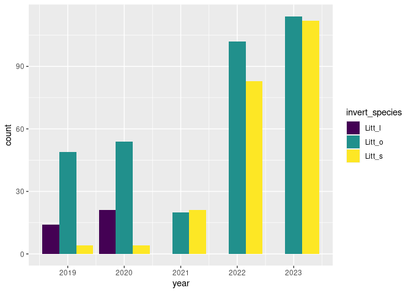
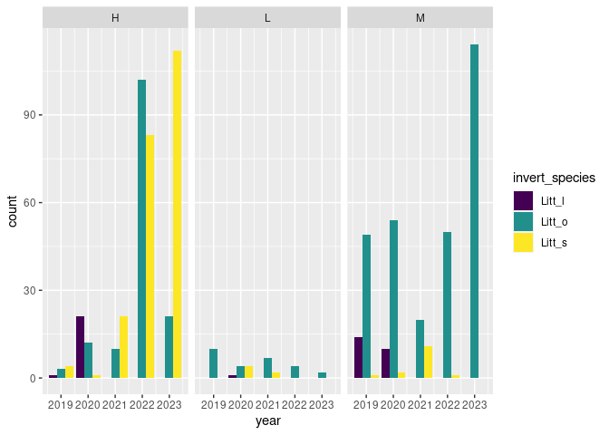
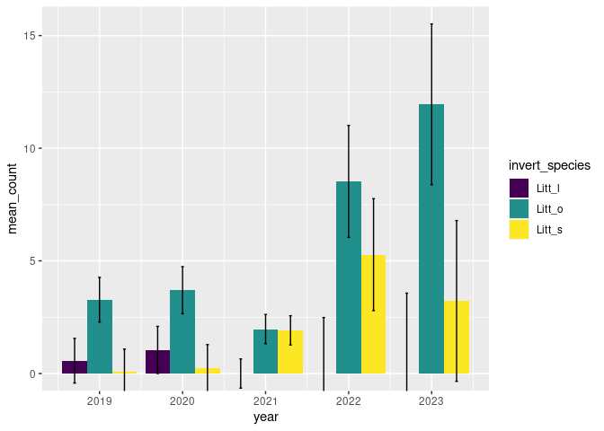
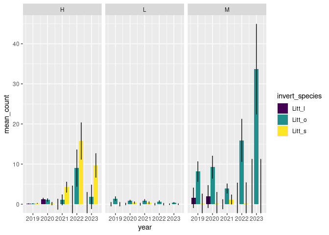
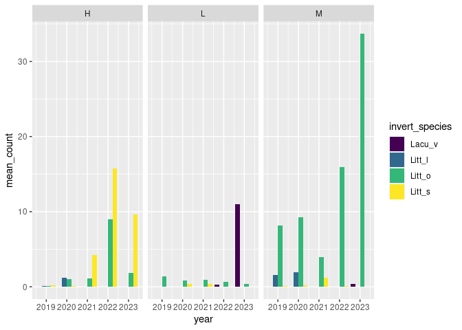

MDR graphs
================
MDR Intertidal

``` r
library(tidyverse)
library(broom)
library(readxl)
```

``` r
expanded_inverts_mdr <- read_csv("/cloud/project/extra/expanded_inverts_mdr.csv")
```

    ## Rows: 9652 Columns: 7
    ## ── Column specification ────────────────────────────────────────────────────────
    ## Delimiter: ","
    ## chr  (2): tide_ht, invert_species
    ## dbl  (4): year, quadrat_m, count, quadrat_number
    ## dttm (1): date
    ## 
    ## ℹ Use `spec()` to retrieve the full column specification for this data.
    ## ℹ Specify the column types or set `show_col_types = FALSE` to quiet this message.

``` r
# total number per quadrat, unfaceted

expanded_inverts_mdr %>%
  filter(invert_species %in% c("Litt_l",
                               "Litt_o",
                               "Litt_s"),
         !(year == 2017)) %>%
  ggplot(mapping = aes(year, count, fill = invert_species)) +
    geom_col(position = "dodge") +
  scale_fill_viridis_d()
```

<!-- -->

``` r
expanded_inverts_mdr %>%
  filter(invert_species %in% c("Litt_l",
                               "Litt_o",
                               "Litt_s"),
         !(year == 2017),
         !is.na(tide_ht)) %>%
  ggplot(mapping = aes(year, count, fill = invert_species)) +
    geom_col(position = "dodge") +
  scale_fill_viridis_d() +
  facet_wrap("tide_ht", nrow = 1)
```

<!-- -->

``` r
# omitted 2017 and 2018 for all snail graphs (2017 includes L_spp, so not useful for these graphs, and 2018 is too messy)
```

``` r
expanded_inverts_mdr %>%
  filter(invert_species %in% c("Litt_l",
                               "Litt_o",
                               "Litt_s"),
         !(year == 2017),
         !is.na(tide_ht)) %>%
  group_by(year, invert_species) %>%
  summarise(mean_count = mean(count)) %>%
  mutate(se = sd(mean_count, na.rm=TRUE)/sqrt(length(mean_count))) %>%
  ggplot(mapping = aes(year, mean_count, fill = invert_species)) +
    geom_col(position = "dodge") +
  geom_errorbar(aes(ymin = mean_count - se, ymax = mean_count + se),
                width=.1, position = position_dodge(.9)) +
  scale_fill_viridis_d() +
  coord_cartesian(ylim = c(0, NA))
```

    ## `summarise()` has grouped output by 'year'. You can override using the
    ## `.groups` argument.

<!-- -->

``` r
expanded_inverts_mdr %>%
  filter(invert_species %in% c("Litt_l",
                               "Litt_o",
                               "Litt_s"),
         !(year == 2017),
         !is.na(tide_ht)) %>%
  group_by(year, tide_ht, invert_species) %>%
  summarise(mean_count = mean(count)) %>%
  mutate(se = sd(mean_count, na.rm=TRUE)/sqrt(length(mean_count))) %>%
  ggplot(mapping = aes(year, mean_count, fill = invert_species)) +
    geom_col(position = "dodge") +
  geom_errorbar(aes(ymin = mean_count - se, ymax = mean_count + se),
                width=.1, position = position_dodge(.9)) +
  scale_fill_viridis_d() +
  facet_wrap("tide_ht", nrow = 1) +
  coord_cartesian(ylim = c(0, NA))
```

    ## `summarise()` has grouped output by 'year', 'tide_ht'. You can override using
    ## the `.groups` argument.

<!-- -->

``` r
# better to have all in same column or all in same row? if in same row, how to make them shorter?
```

``` r
# reorder this so colors of Littorina are the same and L. vincta is last (is there a way to do this without making it an ordered factor?)
# how many years has L. vincta been on the survey? would they have counted it? ask Tanya

expanded_inverts_mdr %>%
  filter(invert_species %in% c("Litt_l",
                               "Litt_o",
                               "Litt_s",
                               "Lacu_v"),
         !(year == 2017),
         !is.na(tide_ht)) %>%
  mutate(count = replace_na(count, 0)) %>%
  group_by(year, tide_ht, invert_species) %>%
  summarise(mean_count = mean(count)) %>%
  ggplot(mapping = aes(year, mean_count, fill = invert_species)) +
    geom_col(position = "dodge") +
  scale_fill_viridis_d() +
  facet_wrap("tide_ht", nrow = 1)
```

    ## `summarise()` has grouped output by 'year', 'tide_ht'. You can override using
    ## the `.groups` argument.

<!-- -->

{r seaweed-graph} expanded_seaweeds_mdr %\>% filter(seaweed_species %in%
c(“asco_nSC”, ))

\#ggplot(mapping = aes(x = proportion, y = quadrat_m)) + \# geom_point()
